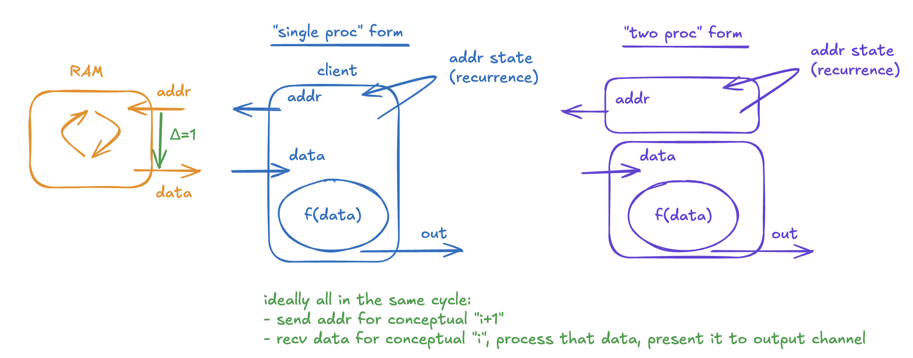

# RAM Fetch ReLU

This family implements the same behavior in five formulations:

1. send an address toward a RAM-like interface
2. receive signed data back
3. apply `ReLU(d)`
4. send the result on an output stream

The shared address source, fake RAM, and output checker now live in
`fetch_relu_common.x`, so each variant only carries the top-level proc logic
that differs.

## Variants

| Variant | File | Shape | Throughput result |
| --- | --- | --- | --- |
| Sequential single proc | `fetch_relu_sequential.x` | One proc with one loop-carried token chain | Fails `worst_case_throughput=1` for a 1-cycle RAM |
| Software-pipelined single proc | `fetch_relu_single_pipelined.x` | One proc with unit state and a fresh `token()` each activation | Scheduler accepts `worst_case_throughput=1` with `--pipeline_stages=2` and reset, but current RTL wave analysis still shows interface bubbles |
| Dual-token single proc | `fetch_relu_single_dual_token.x` | One proc with separate carried token lanes for request and response | Reset-enabled codegen reaches `worst_case_throughput=1`, but current RTL still shows interface bubbles; the cleaner multi-token state shape also exposes an XLS codegen bug |
| Non-blocking single proc | `fetch_relu_single_nonblocking.x` | One proc with blocking request issue and non-blocking response retirement | Reaches `worst_case_throughput=1` with one stage and is bubble-free in the repo's 1-cycle RAM harness |
| Split design | `fetch_relu_split.x` | Request and response handled by separate procs | Reaches `worst_case_throughput=1` with one stage per proc |

## Conceptual Model



The diagram captures the ideal steady-state model for this family:

- the true recurrence is the address state,
- the RAM has a 1-cycle response latency,
- in steady state one logical step should send `addr[i+1]` while also retiring
  `data[i] -> f(data[i]) -> out[i]`.

This is the conceptual split behind the variants:

- `fetch_relu_sequential.x` does **not** match the ideal model, because the
  whole transaction becomes the recurrence:
  `recv(addr) -> send(req) -> recv(resp) -> send(out)`.
- `fetch_relu_split.x` matches the diagram most directly: `SendAddr` carries
  the address recurrence, while `RecvRelu` handles
  `data -> f(data) -> out`.
- `fetch_relu_single_nonblocking.x` is the closest single-proc approximation:
  request issue keeps following the address recurrence, and response
  retirement is optional on a given activation.
- `fetch_relu_single_pipelined.x` and `fetch_relu_single_dual_token.x` are
  attempts to express the same overlap inside one proc, but the generated RTL
  still couples request progress to response/output progress.

## Diagram

```mermaid
flowchart TD
    subgraph SharedBehavior[Shared behavior]
        A[Address stream] --> B[RAM request]
        C[RAM response] --> D[ReLU]
        D --> E[Output stream]
    end

    subgraph Single[Sequential single proc]
        S1[recv addr_i] --> S2[send req_i]
        S2 --> S3[recv resp_i]
        S3 --> S4[send out_i]
        S4 --> S5[start i+1]
    end

    subgraph SingleP[Software-pipelined single proc]
        P0[stage 0: recv addr_i / send req_i]
        P1[stage 1: recv resp_i / ReLU / send out_i]
        P0 --> P1
        P0 -. overlaps with .-> P1prev[stage 1 for i-1]
    end

    subgraph SingleDT[Dual-token single proc]
        D0[req token lane: recv addr_i / send req_i]
        D1[resp token lane: recv resp_i / ReLU / send out_i]
        D0 -. separate carried token .-> D1
    end

    subgraph SingleNB[Non-blocking single proc]
        N0[recv addr_i / send req_i every cycle]
        N1[if resp available: ReLU / send out]
        N0 --> N1
        N1 -. response retirement is optional per activation .-> N0
    end

    subgraph Split[Split proc design]
        T1[SendAddr proc] --> T2[RAM]
        T2 --> T3[RecvRelu proc]
    end
```



## Bubble-Freeness

The key distinction is not "single proc" versus "multiple procs". The key
distinction is whether request issue is forced to wait for response retirement.

- If the proc shape makes `recv(resp)` part of the required path before the next
  activation can launch a new request, the interface bubbles.
- If response retirement is decoupled or optional, requests can keep launching
  every cycle and the interface can stay bubble-free.

In this family that means:

- `fetch_relu_sequential.x`: **not bubble-free**, because one loop-carried token
  serializes `recv(addr) -> send(req) -> recv(resp) -> send(out)`.
- `fetch_relu_single_pipelined.x`: **not bubble-free**, because the current RTL
  flow still bubbles at the interface even though the scheduler accepts
  `worst_case_throughput=1` and internal occupancy stays full.
- `fetch_relu_single_dual_token.x`: **not bubble-free**, because the reset-enabled
  generated RTL still shows multi-cycle interface gaps in this harness even
  though the proc explicitly carries separate request and response token lanes.
- `fetch_relu_single_nonblocking.x`: **bubble-free**, in the repo's 1-cycle RAM
  harness, because `recv_non_blocking` and `send_if` make response retirement
  optional for a given activation.
- `fetch_relu_split.x`: **bubble-free**, because request traffic and
  response/output traffic live on separate token loops.

## Worst-Case Throughput

`worst_case_throughput=N` in XLS is best read as a bound on the proc's
internal recurrence, not as a direct promise that every channel interface will
handshake once every `N` cycles.

Under an ideal environment:

- output channels are always ready,
- input channels present data whenever the proc expects it,

any remaining steady-state gap is self-induced by loop-carried state/token
dependencies or by internal coupling between channel operations. Startup
latency is separate from that steady-state recurrence.

In this family that means:

- `fetch_relu_sequential.x` has a recurrence greater than 1, so its bubbles are
  fundamental to the proc shape.
- `fetch_relu_single_pipelined.x` and `fetch_relu_single_dual_token.x` can be
  scheduled at `worst_case_throughput=1`, but the generated RTL still
  self-bubbles at the interfaces in the nominal harness.
- `fetch_relu_single_nonblocking.x` and `fetch_relu_split.x` both reach
  `worst_case_throughput=1` and are also interface bubble-free in the nominal
  harness.

## Sweep Results

`make wave-sweep` compares `fetch_relu_split.x` and
`fetch_relu_single_nonblocking.x` under fixed RAM latency and deterministic
ready/valid stalls.

The current result is:

- Both variants stay bubble-free on request issue and output retirement for
  fixed RAM latencies of 1, 2, and 3 cycles when the environment is otherwise
  always ready.
- Under output-channel backpressure, `fetch_relu_split.x` keeps the request
  side bubble-free, while `fetch_relu_single_nonblocking.x` develops request
  issue bubbles.
- Under request-channel backpressure, both variants keep the request side
  bubble-free; output gaps in that case are driven by upstream starvation.

## Boundary I/O Kinds

The proc source is not the only thing that affects the observed waveforms.
XLS codegen also chooses how ready/valid boundaries are lowered at the module
ports. In this family the most informative knob is the output-side choice:

- `--flop_outputs_kind=flop`
- `--flop_outputs_kind=skid`
- `--flop_outputs_kind=zerolatency`

These choices change boundary buffering and backpressure propagation, not the
meaning of the proc program itself.

`make wave-io-kind-sweep` compares those output kinds for:

- `fetch_relu_split.x`
- `fetch_relu_single_nonblocking.x`
- `fetch_relu_single_pipelined.x`

under a nominal 1-cycle RAM harness and an output-backpressure case.

The current result is:

- `fetch_relu_split.x` stays bubble-free on request issue and output
  retirement across all three output kinds in these scenarios.
- `fetch_relu_single_nonblocking.x` stays bubble-free in the nominal harness
  for all three output kinds.
- Under output backpressure, `fetch_relu_single_nonblocking.x` keeps request
  issue bubble-free with `skid`, but still develops request-side bubbles with
  `flop` and `zerolatency`.
- `fetch_relu_single_pipelined.x` remains **not bubble-free** for all three
  output kinds. `zerolatency` shortens the visible interface gaps, but it does
  not remove them.

So the conceptual split is:

- proc structure determines whether the design is intrinsically coupled,
- boundary I/O kind determines how strongly backpressure is able to propagate
  through the generated interface logic.

## Notes

- `fetch_relu_sequential.x` is the semantic baseline for the end-to-end transaction.
- `fetch_relu_single_pipelined.x` shows that the scheduler can overlap request and response work inside one proc if the proc state no longer serializes activations through one carried token.
- `make wave-analysis` currently shows that the generated single-proc pipelined RTL still accepts `ram_req` and emits `out_ch` with three-cycle gaps in this 1-cycle RAM harness, even though its internal `p0_valid` occupancy stays full.
- `fetch_relu_single_dual_token.x` tests whether separate carried token lanes inside one proc behave like the split design. In the current toolchain they do not: the reset-enabled RTL still bubbles, and a smaller multi-token-state reproducer in `repros/multi_token_state_codegen_bug.x` exposes a related XLS internal codegen error.
- `fetch_relu_single_nonblocking.x` is the current single-proc formulation that actually stays bubble-free at the interface in this harness by making the response side optional with `recv_non_blocking` and `send_if`.
- `fetch_relu_split.x` is the most direct throughput-friendly formulation and the easiest to reason about in RTL.

## Repo Targets

Run the family checks from the repo root:

```sh
make dslx-test
make codegen-check
make rtl-sim-split
make rtl-sim-single-pipelined
make rtl-sim-single-dual-token
make rtl-sim-single-nonblocking
make wave-analysis
make wave-sweep
make wave-io-kind-sweep
```
