# RAM Fetch ReLU

This family implements the same behavior in four formulations:

1. send an address toward a RAM-like interface
2. receive signed data back
3. apply `ReLU(d)`
4. send the result on an output stream

The shared address source, fake RAM, and output checker now live in
`fetch_relu_common.x`, so each variant only carries the top-level proc logic
that differs.

## Variants

| Variant | File | Shape | Throughput result |
| --- | --- | --- | --- |
| Serialized single proc | `fetch_relu_single.x` | One proc with one loop-carried token chain | Fails `worst_case_throughput=1` for a 1-cycle RAM |
| Software-pipelined single proc | `fetch_relu_single_pipelined.x` | One proc with unit state and a fresh `token()` each activation | Scheduler accepts `worst_case_throughput=1` with `--pipeline_stages=2` and reset, but current RTL wave analysis still shows interface bubbles |
| Non-blocking single proc | `fetch_relu_single_nonblocking.x` | One proc with blocking request issue and non-blocking response retirement | Reaches `worst_case_throughput=1` with one stage and is bubble-free in the repo's 1-cycle RAM harness |
| Split design | `fetch_relu_split.x` | Request and response handled by separate procs | Reaches `worst_case_throughput=1` with one stage per proc |

## Diagram

```mermaid
flowchart TD
    subgraph SharedBehavior[Shared behavior]
        A[Address stream] --> B[RAM request]
        C[RAM response] --> D[ReLU]
        D --> E[Output stream]
    end

    subgraph Single[Serialized single proc]
        S1[recv addr_i] --> S2[send req_i]
        S2 --> S3[recv resp_i]
        S3 --> S4[send out_i]
        S4 --> S5[start i+1]
    end

    subgraph SingleP[Software-pipelined single proc]
        P0[stage 0: recv addr_i / send req_i]
        P1[stage 1: recv resp_i / ReLU / send out_i]
        P0 --> P1
        P0 -. overlaps with .-> P1prev[stage 1 for i-1]
    end

    subgraph SingleNB[Non-blocking single proc]
        N0[recv addr_i / send req_i every cycle]
        N1[if resp available: ReLU / send out]
        N0 --> N1
        N1 -. response retirement is optional per activation .-> N0
    end

    subgraph Split[Split proc design]
        T1[SendAddr proc] --> T2[RAM]
        T2 --> T3[RecvRelu proc]
    end
```



## Notes

- `fetch_relu_single.x` is the semantic baseline for the end-to-end transaction.
- `fetch_relu_single_pipelined.x` shows that the scheduler can overlap request and response work inside one proc if the proc state no longer serializes activations through one carried token.
- `make wave-analysis` currently shows that the generated single-proc pipelined RTL still accepts `ram_req` and emits `out_ch` only every other cycle in this 1-cycle RAM harness, even though its internal `p0_valid` occupancy stays full.
- `fetch_relu_single_nonblocking.x` is the current single-proc formulation that actually stays bubble-free at the interface in this harness by making the response side optional with `recv_non_blocking` and `send_if`.
- `fetch_relu_split.x` is the most direct throughput-friendly formulation and the easiest to reason about in RTL.

## Repo Targets

Run the family checks from the repo root:

```sh
make dslx-test
make codegen-check
make rtl-sim-split
make rtl-sim-single-pipelined
make rtl-sim-single-nonblocking
make wave-analysis
```
